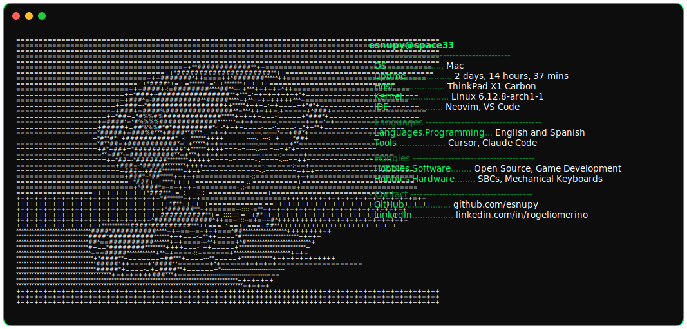

  

---

- 👋 Hola, soy **@esnupy** (`esnupy@space33`)
- 🧠 Interesado en **IA** y herramientas de desarrollo (Cursor, Claude Code)
- 🌱 Aprendiendo a romper el código — un bug a la vez
- 🤝 Busco colaborar en **Open Source** y proyectos de game dev
- 🛠️ Stack de editor: Neovim, VS Code
- 🎮 Hobbies: SBCs, teclados mecánicos, game development
- 📫 **GitHub:** [github.com/esnupy](https://github.com/esnupy)
- 💼 **LinkedIn:** [linkedin.com/in/rogeliomerino](https://linkedin.com/in/rogeliomerino)

<!---
esnupy/esnupy es un repositorio ✨ especial ✨: este README aparece en tu perfil de GitHub.
--->
